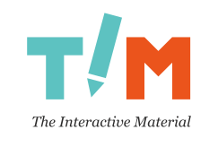

# TIM - The Interactive Material

**TIM** (*The Interactive Material*) is an open source cloud-based platform
for creating interactive documents such as:

* lecture notes
* eBooks
* weekly exercises
* exams
* manuals
* workbooks
* discussions

TIM can be used for:

* normal lectures
* peer instruction
* self studying
* MOOC
* Flipped Classroom
* anything else you can imagine!

For more information about TIM, please
see [the introduction](https://tim.jyu.fi/view/tim/in-English/intro).

## Building and development

Currently, all development documentation is in Finnish only.

The most important documents are the following:

* [Building TIM](https://tim.jyu.fi/view/tim/TIMin-kehitys/TIMin-kaantaminen):
How to build TIM and run it on a local machine
* [Introduction to TIM development](https://tim.jyu.fi/view/tim/TIMin-kehitys/Johdatus-TIMin-kehitykseen):
Getting familiar with the basics of TIM
* [Coding conventions](https://tim.jyu.fi/view/tim/TIMin-kehitys/Koodikaytanteet):
Guidelines on how to write new code
* [PyCharm](https://tim.jyu.fi/view/tim/TIMin-kehitys/PyCharm):
How to set up PyCharm for TIM development

More documentation can be found in the
[TIM development](https://tim.jyu.fi/view/tim/TIMin-kehitys) folder.
